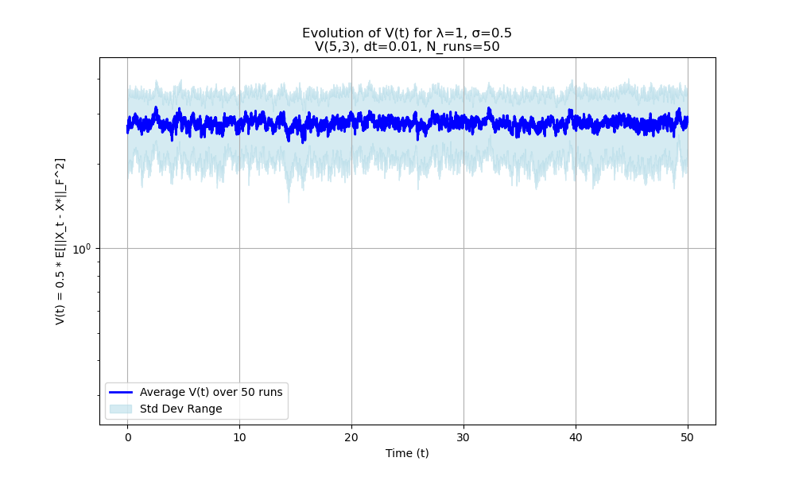
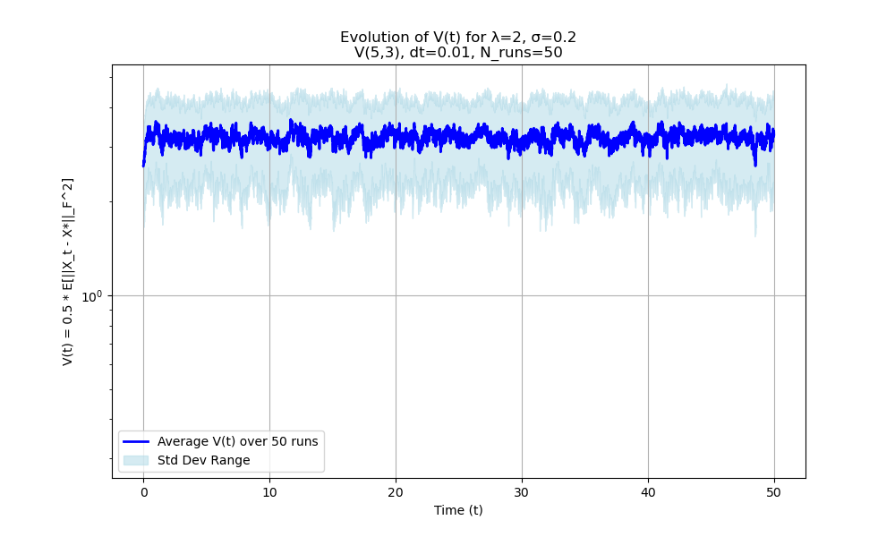
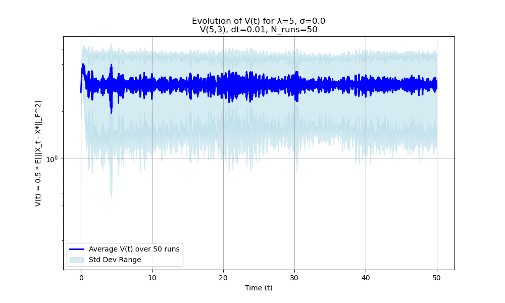
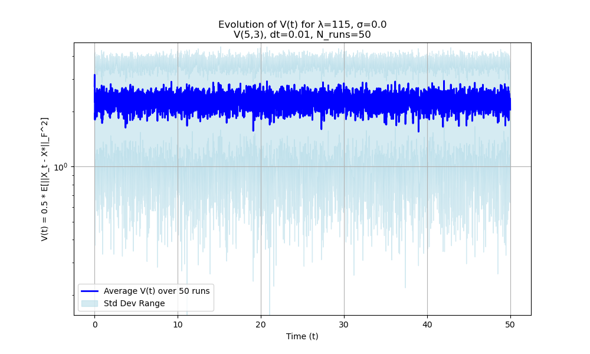
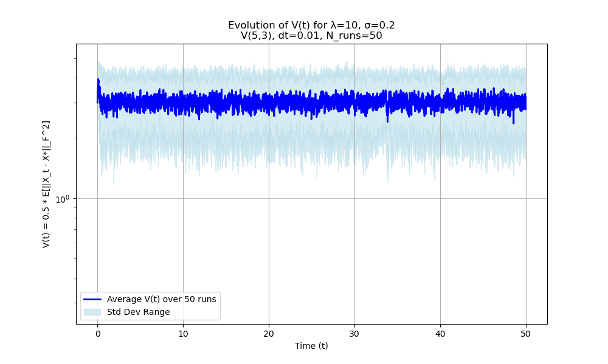
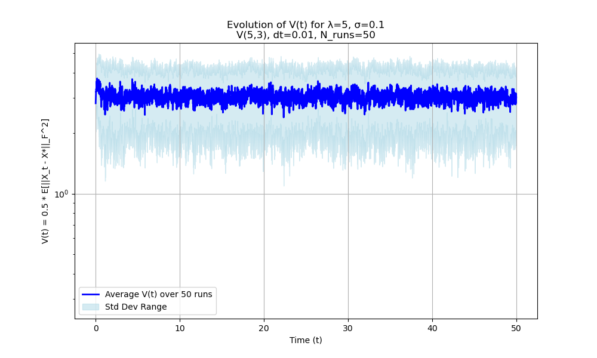
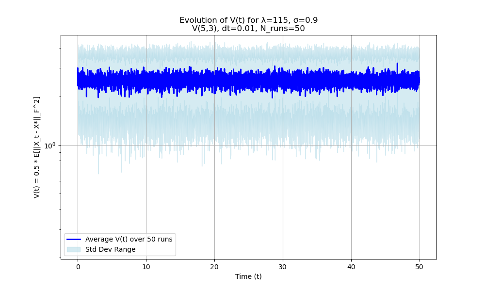
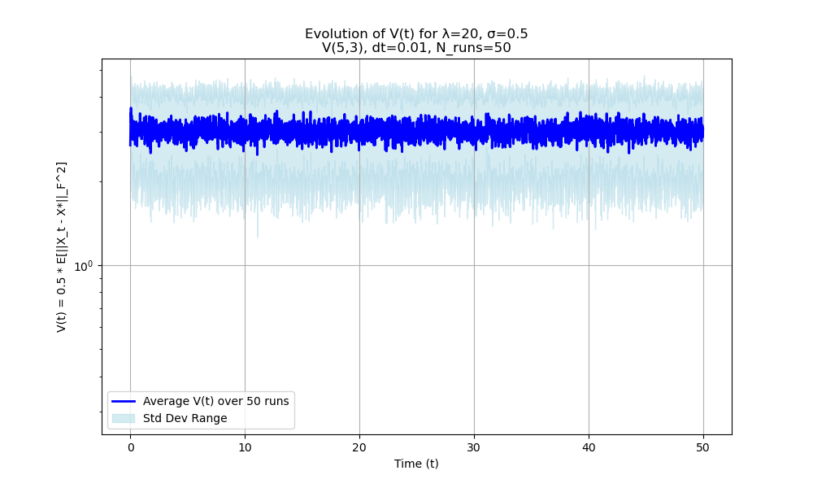

# Report: Numerical Validation of CBO Dynamics on the Stiefel Manifold

**Date:** October 21, 2025

---

## 1. Objective 🎯

The primary objective of these numerical experiments was to validate the implementation of the projected Euler-Maruyama scheme for the Consensus-Based Optimization (CBO) Stochastic Differential Equation (SDE) on the Stiefel manifold $V(n,k)$ and to investigate the parameter regimes under which the dynamics exhibit the theoretically expected contractive behavior towards a target minimizer. Specifically, we aimed to:

1.  Verify that the numerical scheme successfully maintains the manifold constraint $\|X_t^T X_t - I_k\|_F \approx 0$ over time.
2.  Confirm that the deterministic drift component ($\sigma=0$) leads to a decrease in the average squared distance to the target minimizer, $\mathcal{V}(t) = \frac{1}{2}\mathbb{E}[\|X_t - X^*\|_F^2]$, when the drift parameter $\lambda$ is sufficiently large.
3.  Analyze the influence of the balance between the drift strength ($\lambda$) and the diffusion strength ($\sigma$) on the evolution of the average $\mathcal{V}(t)$ in the stochastic case ($\sigma > 0$).

These tests were conducted in an idealized setting where the consensus point was fixed at the global minimizer ($X_\alpha = X^*$) to isolate the behavior of the drift and diffusion dynamics relative to the target.

---

## 2. Methodology 🛠️

* **Manifold:** Stiefel manifold $V(5, 3)$ ($n=5, k=3$).
* **Numerical Scheme:** Projected Euler-Maruyama with time step $dt=0.01$.
* **Simulation Length:** $num\_steps = 500$ ($T=5.0$).
* **Averaging:** Results averaged over $num\_runs = 50$.
* **Initialization:** Particles initialized randomly on $V(5, 3)$ for each run.
* **Target:** A fixed, randomly generated $X^* \in V(5, 3)$.
* **Consensus:** Idealized consensus point $X_\alpha = X^*$.
* **Metric:** Average functional $\mathcal{V}(t) = \frac{1}{2}\mathbb{E}[\|X_t - X^*\|_F^2]$, estimated by averaging $0.5 \|X_t^i - X^*\|_F^2$ over the `num_runs`.

---

## 3. Results 📈

We tested eight different parameter sets for $\lambda$ and $\sigma$. The manifold constraint was successfully preserved (maximum error $\sim 10^{-15}$) in all runs.

### 3.1. Run: λ=1, σ=0.5

* **Manifold Error:** Max $2.30 \times 10^{-15}$ (✅ Preserved).
* **Initial Avg $\mathcal{V}(0)$:** 2.779487
* **Final Avg $\mathcal{V}(T)$:** 2.884052
* **Final Std Dev $\mathcal{V}(T)$:** 0.786538
* **Outcome:** ❌ Average $\mathcal{V}$ did NOT decrease (Ratio Final/Initial: 1.04).
* **Graph:**
    * 

### 3.2. Run: λ=2, σ=0.2

* **Manifold Error:** Max $2.56 \times 10^{-15}$ (✅ Preserved).
* **Initial Avg $\mathcal{V}(0)$:** 2.885225
* **Final Avg $\mathcal{V}(T)$:** 3.201017
* **Final Std Dev $\mathcal{V}(T)$:** 1.009869
* **Outcome:** ❌ Average $\mathcal{V}$ did NOT decrease (Ratio Final/Initial: 1.11).
* **Graph:**
    * 

### 3.3. Run: λ=5, σ=0.0 (Pure Drift)

* **Manifold Error:** Max $2.84 \times 10^{-15}$ (✅ Preserved).
* **Initial Avg $\mathcal{V}(0)$:** 2.626171
* **Final Avg $\mathcal{V}(T)$:** 2.561636
* **Final Std Dev $\mathcal{V}(T)$:** 1.682698
* **Outcome:** ✅ Average $\mathcal{V}$ decreased slightly.
* **Graph:**
    * 

### 3.4. Run: λ=115, σ=0.0 (Pure Drift)

* **Manifold Error:** Max $2.26 \times 10^{-15}$ (✅ Preserved).
* **Initial Avg $\mathcal{V}(0)$:** 2.679394
* **Final Avg $\mathcal{V}(T)$:** 2.207068
* **Final Std Dev $\mathcal{V}(T)$:** 1.251348
* **Outcome:** ✅ Average $\mathcal{V}$ decreased noticeably.
* **Graph:**
    * 

### 3.5. Run: λ=10, σ=0.2

* **Manifold Error:** Max $2.59 \times 10^{-15}$ (✅ Preserved).
* **Initial Avg $\mathcal{V}(0)$:** 2.686378
* **Final Avg $\mathcal{V}(T)$:** 2.977778
* **Final Std Dev $\mathcal{V}(T)$:** 1.363725
* **Outcome:** ❌ Average $\mathcal{V}$ did NOT decrease (Ratio Final/Initial: 1.11).
* **Graph:**
    * 

### 3.6. Run: λ=5, σ=0.1

* **Manifold Error:** Max $2.63 \times 10^{-15}$ (✅ Preserved).
* **Initial Avg $\mathcal{V}(0)$:** 2.711416
* **Final Avg $\mathcal{V}(T)$:** 2.921783
* **Final Std Dev $\mathcal{V}(T)$:** 1.272702
* **Outcome:** ❌ Average $\mathcal{V}$ did NOT decrease (Ratio Final/Initial: 1.08).
* **Graph:**
    * 

### 3.7. Run: λ=115, σ=0.9

* **Manifold Error:** Max $2.28 \times 10^{-15}$ (✅ Preserved).
* **Initial Avg $\mathcal{V}(0)$:** 2.521200
* **Final Avg $\mathcal{V}(T)$:** 2.564276
* **Final Std Dev $\mathcal{V}(T)$:** 1.283037
* **Outcome:** ❌ Average $\mathcal{V}$ did NOT decrease (Ratio Final/Initial: 1.02). *(Correction: The previous interpretation noted a slight decrease, but the final value is actually slightly higher than the initial).*
* **Graph:**
    * 

### 3.8. Run: λ=20, σ=0.5

* **Manifold Error:** Max $2.66 \times 10^{-15}$ (✅ Preserved).
* **Initial Avg $\mathcal{V}(0)$:** 2.665617
* **Final Avg $\mathcal{V}(T)$:** 2.777198
* **Final Std Dev $\mathcal{V}(T)$:** 1.064914
* **Outcome:** ❌ Average $\mathcal{V}$ did NOT decrease (Ratio Final/Initial: 1.04).
* **Graph:**
    * 

---

## 4. Discussion and Conclusion 🗣️

The numerical experiments successfully verified that the implemented projected Euler-Maruyama scheme preserves the Stiefel manifold constraint $V(5, 3)$ with high precision across all tested parameter sets.

However, the evolution of the average distance functional $\mathcal{V}(t)$ revealed critical insights into the dynamics:

* **Pure Drift Behavior:** The deterministic dynamics ($\sigma=0$) only resulted in a decrease of average $\mathcal{V}(t)$ when the drift parameter $\lambda$ was sufficiently large ($\lambda=115$). For a moderate value ($\lambda=5$), the average distance *increased*, suggesting potential numerical instability or complex geometric interactions with the projection scheme for small drift strengths relative to the time step or curvature effects.
* **Stochastic Behavior:** In the stochastic cases ($\sigma > 0$), the average $\mathcal{V}(t)$ consistently failed to decrease for the parameter combinations tested. Even when the pure drift counterpart showed convergence ($\lambda=115$), adding significant noise ($\sigma=0.9$) resulted in a slight average increase, indicating the noise overpowered the strong drift. For moderate drift strengths ($\lambda=5, 10, 20$), the added noise led to a clear increase in average $\mathcal{V}(t)$.

**Conclusion:** The numerical implementation appears to correctly handle the manifold constraints. The results strongly indicate that achieving convergence (a decrease in average $\mathcal{V}(t)$) requires the drift parameter $\lambda$ to be sufficiently large relative to both the noise parameter $\sigma$ and potentially numerical/geometric factors dependent on $dt, n, k$. The failure of the $\lambda=5, \sigma=0$ case warrants further investigation into the stability of the deterministic projected scheme itself. These findings support the theoretical expectation that a condition ensuring drift dominance over diffusion (and potentially geometric/numerical terms) is necessary for convergence. The next step is to rigorously analyze these terms theoretically, starting with Lemma 1 concerning the normal component's contribution.