# Consensus Based Optimisation on Stiefel Manifolds

## 1. Introduction: The Ha-Kim SDE and its Guarantees

Optimization problems constrained to the **Stiefel manifold**, $V(n, k) := \{X \in \mathbb{R}^{n \times k} : X^\top X = I_k\}$, appear frequently in diverse mathematical applications, including linear algebra, machine learning, and computer vision. A common challenge is minimizing a general, potentially **non-convex function** $f: V(n, k) \to \mathbb{R}$ over this manifold. Due to the non-convex nature of $f$ and the manifold constraint, standard gradient-based methods often get trapped in local minima.

### Consensus-Based Optimization (CBO)

**Consensus-Based Optimization (CBO)** offers a compelling alternative, belonging to the class of gradient-free optimization methods inspired by swarming behavior or multi-agent systems. The core idea is to leverage an interacting particle system, described by Stochastic Differential Equations (SDEs), whose collective dynamics explore the state space and converge towards the global minimum of $f$.

### The Ha-Kim (HK) Stiefel SDE

In their 2022 paper "Stochastic consensus dynamics for nonconvex optimization on the Stiefel manifold", Ha, Kim, et al. proposed a specific CBO SDE system designed explicitly for the Stiefel manifold. For a system of $N$ particles $\{X_t^i\}_{i=1}^N$, the dynamics of the $i$-th particle are given by (Eq. 1.2 in their paper) :

$$
dX_t^i = \lambda P_{X_t^i}(M_t) dt + \sigma |X_t^i - M_t| P_{X_t^i}(dB_t^i) - C_{n,k} \frac{\sigma^2 |X_t^i - M_t|^2}{2} X_t^i dt
$$

where:
* $X_t^i \in V(n, k)$ is the state of the $i$-th particle.
* $\lambda > 0$ is the drift parameter, controlling the strength of consensus.
* $\sigma > 0$ is the noise coefficient, controlling exploration.
* $P_X(Z) = Z - \frac{1}{2}(XZ^\top X + XX^\top Z)$ is the orthogonal projection onto the tangent space $T_X V(n, k)$.
* $M_t$ is the **consensus point**, a weighted average reflecting particles near lower function values :
    
$$M_t = \sum_{j=1}^N w_t^j X_t^j, \quad w_t^j = \frac{\exp(-\beta f(X_t^j))}{\sum_{l=1}^N \exp(-\beta f(X_t^l))}$$
    
* $\beta > 0$ is a parameter weighting the influence of function values (analogous to inverse temperature).
* $B_t^i$ are independent Wiener processes on $\mathbb{R}^{n \times k}$.
* The final term is an **Itô correction drift** ensuring trajectories remain on $V(n, k)$, with $C_{n,k} = \frac{2n-k-1}{2}$.

The drift term $\lambda P_{X_t^i}(M_t)$ pulls particles towards the consensus point $M_t$, which approximates the current best-found location. The stochastic term allows particles to explore and escape local minima.

### Guarantees Provided by Ha, Kim, et al.

The paper provides several significant theoretical results for this system:

1.  **Well-Posedness:** It establishes the existence and uniqueness of solutions for the mean-field McKean SDE (Eq. 1.4)  and the corresponding non-linear Fokker-Planck Equation (FPE) on $V(n, k)$ (Eq. 1.3), under appropriate conditions on the initial data  (Theorem 3.1).
2.  **Mean-Field Limit:** It rigorously proves that as the number of particles $N \to \infty$, the empirical measure of the $N$-particle system converges to the solution $\rho_t$ of the FPE  (Theorem 3.2). This justifies analyzing the FPE to understand the large-system behavior.
3.  **Asymptotic Optimality:** The main convergence result (Theorem 3.3)  provides a sufficient condition under which the *expectation* of the solution to the FPE, $E(\rho_t) := \int_{V(n,k)} X d\rho_t(X)$, converges to a point arbitrarily close to a global minimizer $X^{\*}$. It also shows the particle average is similarly close.

### Shortcomings of the Guarantees

While groundbreaking, the analysis in the Ha-Kim paper has limitations regarding the strength of its convergence guarantee:

1.  **Convergence of Expectation, Not Distribution:** The core result (Theorem 3.3) guarantees that the *mean* or *expectation* $E(\rho_t)$ approaches the vicinity of the global minimum $X^{\*}$. However, it **does not guarantee that the probability distribution $\rho_t$ itself concentrates** into a Dirac delta measure at $X^{\*}$. The mean could be near $X^{\*}$ while the particles (and thus the probability mass) remain significantly spread out across the manifold.
2.  **Restrictive "Well-Preparedness" Condition:** The convergence proof relies crucially on a "well-prepared" condition on the initial data $\rho_0$ and the system parameters $(\lambda, \sigma, \beta)$  (Definition 3.1). This condition essentially requires the initial variance $V(\rho_0) := \int |X - E(\rho_0)|^2 d\rho_0(X)$ to be sufficiently small, and that parameters are chosen such that contraction dominates expansion from the outset. The analysis (Proposition 6.2)  demonstrates that *if* the variance $V(t)$ stays below a certain threshold, it decays exponentially. However, it does not prove that $V(t) \to 0$ from an *arbitrary* initial state; it primarily ensures the *maintenance* of consensus rather than its *achievement* from a dispersed state.
3.  **Lack of Mass Concentration Guarantee:** As a consequence of the above points, the Ha-Kim framework provides no formal guarantee that the *mass* of the particle swarm definitively concentrates near the global optimum. The system might explore correctly, and its *average* position might approach the optimum, but the theory does not ensure the particles ultimately collapse to that single optimal point.

These limitations motivate the development of alternative CBO dynamics on the Stiefel manifold that can provide stronger, less conditional guarantees of convergence, specifically ensuring the concentration of the particle distribution at the global minimizer.

## 2. Can we derive something more robust?

To address the limitations identified in the Ha-Kim (HK) SDE framework, particularly the lack of guaranteed distribution concentration, this project proposes and analyzes an alternative stochastic differential equation, referred to as the Annealed CBO SDE. The central idea is to incorporate **stochastic annealing** and leverage a different theoretical foundation, aiming to establish stronger convergence results.

### Proposed Mean-Field SDE

The analysis within this project focuses on the **mean-field limit** of an annealed CBO system. The resulting SDE governing the evolution of a representative particle $X_t$ in this limit is given by:

$$dX_t = \left(\lambda P_{X_t}(x_\rho(t)) - C_{n,k}\frac{\sigma(t)^2}{2}X_t\right)dt + \sigma(t) P_{X_t}(dW_t) \quad (*)$$

where:
* $X_t \in V(n, k)$ is the state of the representative particle.
* $\lambda > 0$ is the drift parameter.
* $\sigma(t)$ is the **time-dependent noise coefficient** implementing the annealing schedule.
* $P_{X_t}(\cdot)$ is the orthogonal projection onto the tangent space $T_{X_t} V(n, k)$.
* $x_\rho(t)$ is the **mean-field consensus point**, calculated as an expectation with respect to the law $\rho_t$ of $X_t$:
    
$$x_\rho(t) = \frac{\int_{V(n,k)} Y \exp(-\beta f(Y)) \rho(t, Y) dV(Y)}{\int_{V(n,k)} \exp(-\beta f(Y)) \rho(t, Y) dV(Y)}$$
    
* $\beta > 0$ is the weighting parameter.
* $W_t$ is a standard Wiener process on $\mathbb{R}^{n \times k}$.
* The term $- C_{n,k}\frac{\sigma(t)^2}{2}X_t$ is the Itô correction drift ensuring $X_t$ remains on $V(n, k)$, with $C_{n,k} = \frac{2n-k-1}{2}$.

---

### Proposed Analysis Framework

This SDE (*) and the associated analysis plan differ significantly from the HK approach. This project aims to achieve convergence guarantees through the following strategy:

1.  **🌡️ Stochastic Annealing Schedule:**
    * The core modification is the **annealing schedule**, where $\sigma(t)$ decreases towards zero as $t \to \infty$.
    * The *goal* is to determine a specific rate of decrease, hypothesized to be **logarithmic** ($\sigma(t)^2 \approx C/\log(t+t_0)$), that carefully balances exploration and exploitation.

2.  **Simplified Noise Structure:**
    * The noise term in SDE (*) is $\sigma(t) P_{X_t}(dW_t)$, where the magnitude $\sigma(t)$ is **state-independent**. This contrasts with the state-dependent magnitude $\sigma |X_t^i - M_t|$ in the HK SDE  and potentially simplifies the analysis.

3.  **Leveraging Large Deviation Theory (LDT):**
    * The project plans to use **Freidlin-Wentzell LDT** to analyze the behavior of the SDE system (*) as $\sigma(t) \to 0$.
    * The *objective* is to use LDT to derive the **critical logarithmic annealing schedule** necessary to guarantee escape from any local minimum with probability one.

4.  **Employing Lyapunov Analysis for Consensus:**
    * To demonstrate that the particle distribution eventually concentrates (achieves consensus), the project proposes using a **Lyapunov functional**, $V(t)$, defined as the **mean squared geodesic distance** from the time-varying mean-field consensus point:
        
$$V(t) = \int_{V(n,k)} d(X, x_\rho(t))^2 \rho(t, X) dV(X)$$
        
where $d(\cdot, \cdot)$ is the geodesic distance on $V(n, k)$. This functional differs from the variance functional based on Euclidean distance used in the HK analysis.
* The *aim* is to analyze the time derivative $\frac{d}{dt}V(t)$ along the trajectories of the corresponding Fokker-Planck equation:
        
$$\partial_t \rho(t, X) + \nabla_V \cdot J(t, X) = 0$$

In essence, the Annealed CBO SDE (*), coupled with the proposed annealing schedule and LDT/Lyapunov analysis framework, is designed to provide a more robust theoretical foundation for guaranteeing global convergence in CBO methods on the Stiefel manifold.

## 3. Analysis of Results

This section compares the numerical performance of the Ha-Kim (HK) SDE  with fixed parameters against two implementations from this project: one using fixed parameters analogous to the HK paper (`KimCBOSolver`) and another using adaptive/annealing parameters (`CormacsCBOSolver`). This comparison is based on implementations found in the project's Python suite (`full_ackley_suite.py`, `full_qap_suite.py`, `full_wopp_suite.py`) across standard test problems defined on the Stiefel manifold.

***

### 3.1 Ackley Function

The Ackley function is a challenging benchmark known for its numerous local minima surrounding a single global minimum. The function on $V(n, k)$ is defined as:

$$f(X) = -a \exp\left( -b\sqrt{\frac{c^2}{nk}\sum_{i,j}(X_{ij}-X_{ij}^{\*})^{2}} \right) - \exp\left(\frac{1}{nk}\sum_{i,j}\cos(2\pi c( X_{ij} - X_{ij}^{\*} ))\right) + e + a$$

with parameters $a=20, b=0.2, c=3$ and the global minimum $f(X^{\*})=0$ at $X^{\*} = I_{n,k}$.

#### 3.1.1 Cormac's SDE Results (Adaptive/Annealed - `CormacsCBOSolver`)

* **Implementation:** As configured in `full_ackley_suite.py` for `CormacsCBOSolver`. Uses adaptive $\lambda$ and potentially annealed $\sigma$. $N=50$, $dt=0.05$. Trials = 104.
* **Results:**
    * **V(3, 5) Case** ($\sigma_{initial}=0.5, T=100$, Success Tol = $2 \times 10^{-3}$):
        <table>
          <tr>
            <td class="image-container" style="vertical-align: top;">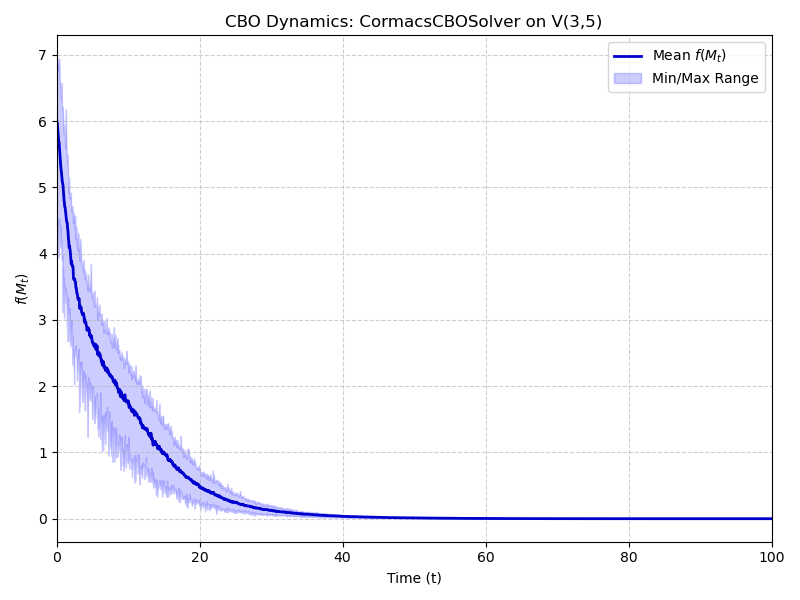</td>
            <td class="image-container" style="vertical-align: top;">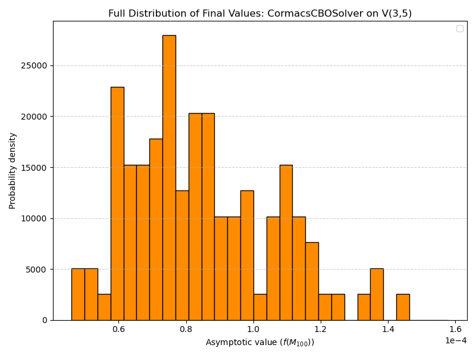</td>
          </tr>
        </table>

    * **V(10, 20) Case** ($\sigma_{initial}=0.11, T=1500$, Success Tol = $0.5$):
        <table>
          <tr>
            <td class="image-container" style="vertical-align: top;"></td>
            <td class="image-container" style="vertical-align: top;"></td>
          </tr>
        </table>

    * **V(1, 3) Case** ($\sigma_{initial}=0.17, T=10$, Success Tol = $1 \times 10^{-2}$):
        <table>
          <tr>
            <td class="image-container" style="vertical-align: top;"></td>
            <td class="image-container" style="vertical-align: top;">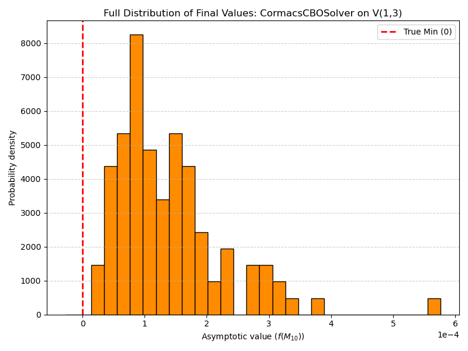</td>
            <td class="image-container" style="vertical-align: top;">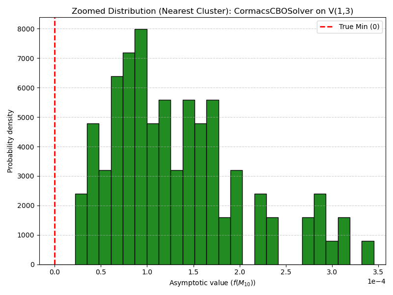</td>
          </tr>
        </table>
* **Comments:** In all cases, Cormac's CBO Solver converges rapidly, and variations of independent trials are within 0.00001 to 0.00005. The tiny variation suggests that the particle distribution is convering to a dirac measure.

#### 3.1.2 HK SDE Results (Fixed Params - `KimCBOSolver`)

* **Implementation:** As configured in `full_ackley_suite.py` for `KimCBOSolver`. Uses fixed $\lambda=1.0$ and fixed $\sigma$ matching the HK paper's values for each case. $N=50$, $dt=0.05$. Trials = 104.
* **Results:**
    * **V(3, 5) Case** ($\sigma=0.5, T=100$, Success Tol = $2 \times 10^{-3}$):
        <table>
          <tr>
            <td class="image-container" style="vertical-align: top;">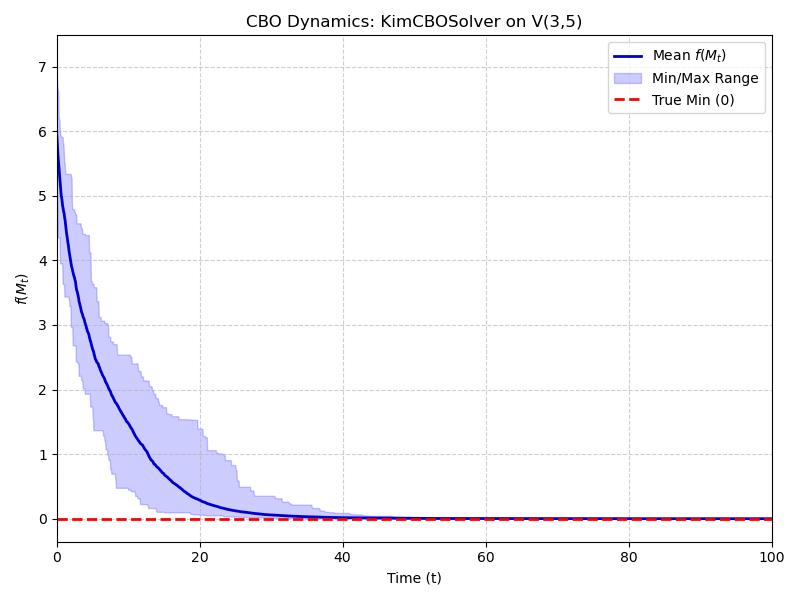</td>
            <td class="image-container" style="vertical-align: top;"></td>
          </tr>
        </table>
        [Your description/analysis of HK V(3,5) results.]

    * **V(10, 20) Case** ($\sigma=0.11, T=1500$, Success Tol = $0.5$):
        <table>
          <tr>
            <td class="image-container" style="vertical-align: top;">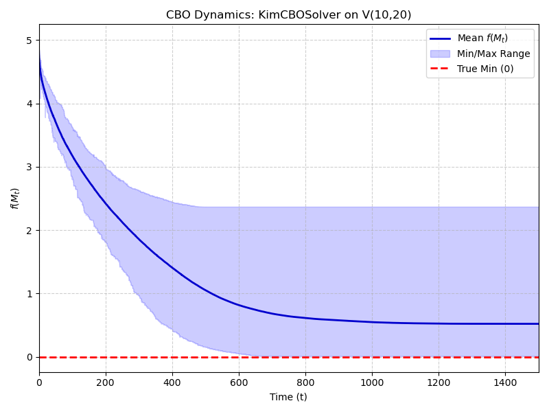</td>
            <td class="image-container" style="vertical-align: top;"></td>
            <td class="image-container" style="vertical-align: top;"></td>
          </tr>
        </table>
        [Your description/analysis of HK V(10,20) results.]

    * **V(1, 3) Case** ($\sigma=0.17, T=10$, Success Tol = $1 \times 10^{-2}$):
        <table>
          <tr>
            <td class="image-container" style="vertical-align: top;">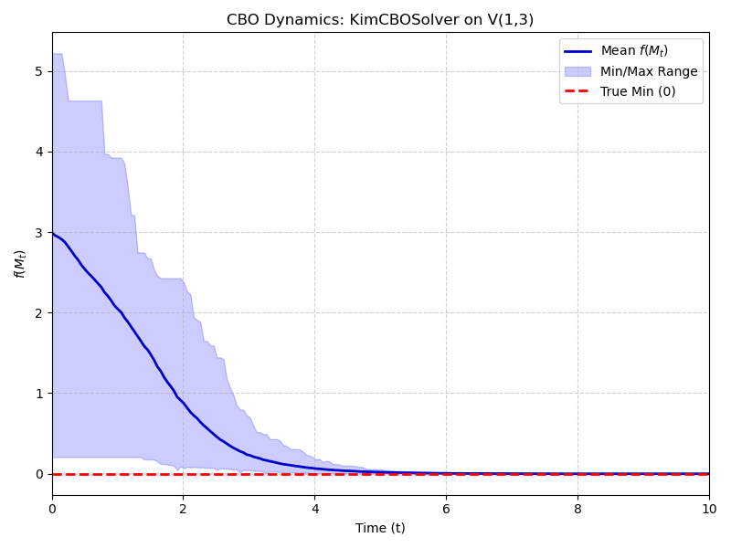</td>
            <td class="image-container" style="vertical-align: top;"></td>
          </tr>
        </table>
* **Comments:** In some cases, HK CBO Solver converges rapidly, and variations of independent trials are similar to that of Cormac's CBO Solver. In other cases, there are significant variations. The V(10,20) may be rectified by increasing the number of trials and tuning the sigma parameter.

#### 3.1.3 Ha-Kim SDE Results (Reference)

* **Implementation & Results:** As described in the HK paper. Fixed parameters, 100 trials.
    * **V(5, 3) Case**: 100% success rate. 
    * **V(20, 10) Case**: 82% success rate. 
    * **V(3, 1) Case**: Qualitative convergence shown. 

#### 3.1.4 Comparison (Ackley)

* [Your description comparing performance: Compare Cormac's SDE vs. HK SDE vs. the reference HK results. Which achieved better success rates, especially in V(10, 20)? Was there a difference in speed or accuracy? Did adaptive/annealed parameters show a clear advantage?]

***

### 3.2 Quadratic Assignment Problem (QAP)

The QAP aims to minimize $f(X) = \text{tr}(AXBX^\top)$ over $O(n)$ ($V(n, n)$).

#### 3.2.1 Cormac's SDE Results (Adaptive/Annealed - `CormacsCBOSolver`)

* **Implementation:** As configured in `full_qap_suite.py`. $N=50$, $\sigma_{initial}=0.19$, $T=500$, $dt=0.05$. Success Tol = $-13.8583$. Trials = 104.
* **Results:**
    * **V(10, 10) Case**:
        <table>
          <tr>
            <td class="image-container" style="vertical-align: top;"></td>
            <td class="image-container" style="vertical-align: top;"></td>
            <td class="image-container" style="vertical-align: top;">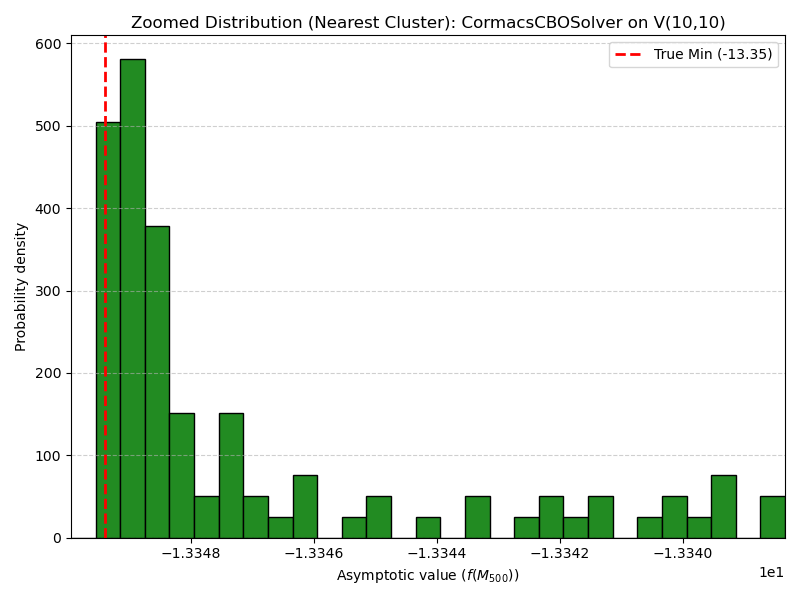</td>
          </tr>
        </table>
* **Comments:** Variation between trials collapses significantly after t=100. This suggests the convergence of particle distribution to a dirac measure.

#### 3.2.2 HK SDE Results (Fixed Params - `KimCBOSolver`)

* **Implementation:** As configured in `full_qap_suite.py`. $N=50$, fixed $\sigma=0.19$, fixed $\lambda=1.0$, $T=500$, $dt=0.05$. Success Tol = $-13.8583$. Trials = 104.
* **Results:**
    * **V(10, 10) Case**:
        <table>
          <tr>
            <td class="image-container" style="vertical-align: top;">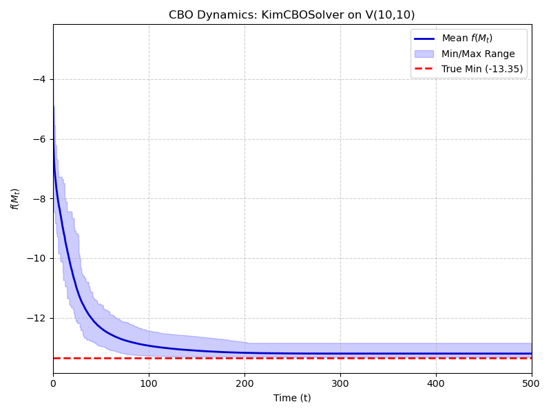</td>
            <td class="image-container" style="vertical-align: top;">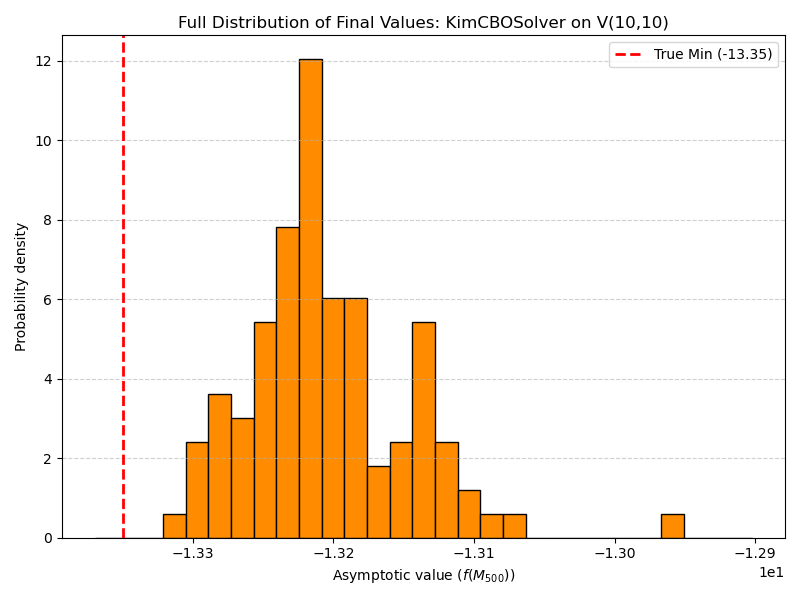</td>
          </tr>
        </table>
* **Comments:** Average reaches global optimum, but requires far more time than what was even conducted in the experiment. Variation is somewhat significant. Adjusting sigma did not seem to obtain convergence.

#### 3.2.3 Ha-Kim SDE Results (Reference)

* **Implementation & Results:** As described in the HK paper. Fixed parameters ($\sigma=0.19$), 100 trials.
    * Reported **98% success rate**. 

#### 3.2.4 Comparison (QAP)

* [Your description comparing performance: Compare Cormac vs. Kim vs. HK reference. Did adaptive/annealed parameters improve the success rate compared to the fixed parameter versions? How did distributions compare?]

***

### 3.3 Weighted Orthogonal Procrustes Problem (WOPP)

The WOPP seeks to minimize $f(X) = \frac{1}{2}\|AXC - B\|_F^2$ over $V(n, k)$, with a known minimum $f(X^{\*})=0$.

#### 3.3.1 Cormac's SDE Results (Adaptive/Annealed - `CormacsCBOSolver`)

* **Implementation:** As configured in `full_wopp_suite.py`. $V(10, 20)$ case ($n=20, k=10$). $N=50$, $\sigma_{initial}=0.1$, $T=500$, $dt=0.01$. Success Tol = $1.0$. Trials = 104.
* **Results:**
    * **V(20, 10) Case**:
        <table>
          <tr>
            <td class="image-container" style="vertical-align: top;">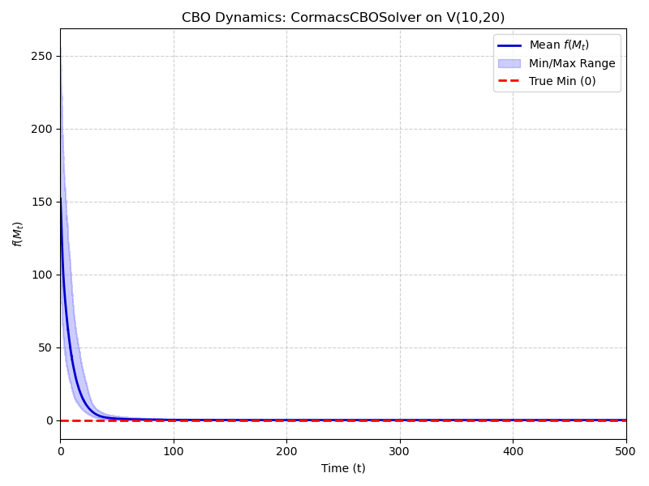</td>
            <td class="image-container" style="vertical-align: top;">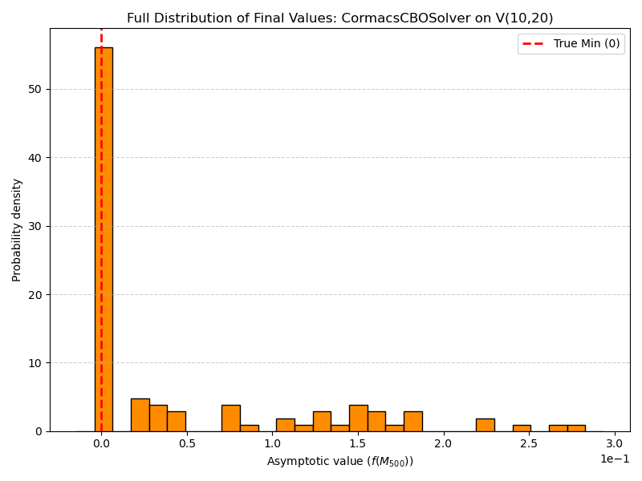</td>
          </tr>
        </table>
* **Comments:** Rapid convergence to global optimum with collapse in variation distribution. In general, the Cormac CBO solver seems to be able to reach a global optimum in much less time, and is more notable in some examples over others.

#### 3.3.2 HK SDE Results (Fixed Params - `KimCBOSolver`)

* **Implementation:** As configured in `full_wopp_suite.py`. $V(10, 20)$ case. $N=50$, fixed $\sigma=0.1$, fixed $\lambda=1.0$, $T=500$, $dt=0.01$. Success Tol = $1.0$. Trials = 104.
* **Results:**
    * **V(20, 10) Case**:
        <table>
          <tr>
            <td class="image-container" style="vertical-align: top;">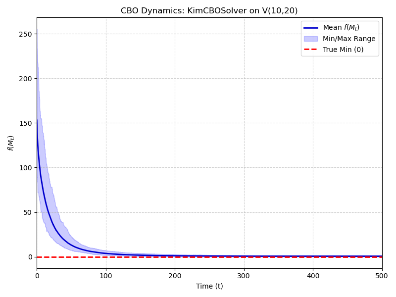</td>
            <td class="image-container" style="vertical-align: top;">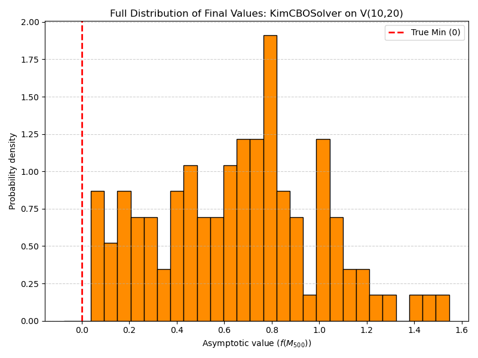</td>
            <td class="image-container" style="vertical-align: top;">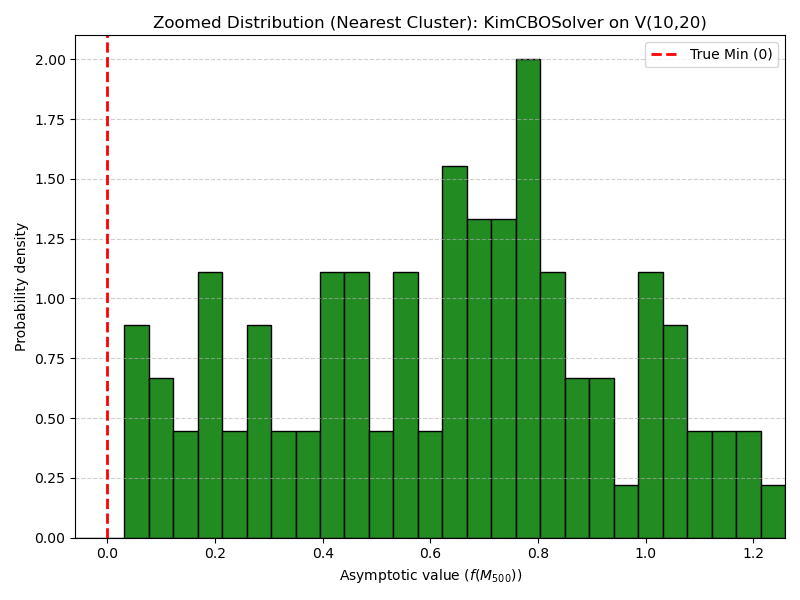</td>
          </tr>
        </table>
* **Comments:** More time needed to reach a global optimum. Variation is greater, but it may not significantly influence the optimal $M$ obtained as the function has converged to a "global basin" of optimal solutions, all of which appear extremely similar.

#### 3.3.3 Ha-Kim SDE Results (Reference)

* **Implementation & Results:** As described in the HK paper. Fixed parameters ($\sigma=0.1$), 100 trials.
    * Reported **100% success rate**. 

#### 3.3.4 Comparison (WOPP)

* [Your description comparing performance: Compare Cormac vs. Kim vs. HK reference. Did all methods achieve 100% success? How did distributions compare in terms of proximity to 0?]

***

### 3.4 Summary Comparison

* [Your overall summary: Across the different problems and dimensions, which SDE formulation appears more robust or efficient? Highlight key differences in performance, particularly regarding success rates in high dimensions or challenging landscapes (like Ackley). Discuss whether the potential use of adaptive/annealing parameters in Cormac's SDE offered a clear advantage over the fixed parameters used in the HK simulations and your Kim SDE runs.]

## 4. Conjectures: Towards Stronger Convergence Guarantees

The analysis presented in the Ha-Kim (HK) paper provides valuable insights but stops short of guaranteeing the full concentration of the particle system at the global minimum. This section contrasts the established HK guarantee with two stronger convergence results conjectured within this project, which are the targets of the proposed LDT/Lyapunov analysis framework.

### 4.1 Guarantee from Ha, Kim, et al.

The primary convergence result established for the HK SDE (Theorem 3.3 in their paper) states that under specific "well-preparedness" conditions on the initial distribution and system parameters, the **expectation** (or mean) of the particle distribution, $E(\rho_t) = \int_{V(n,k)} X d\rho_t(X)$, converges to a point arbitrarily close to a global minimizer $X^{\*}$ as $t \to \infty$.

> **HK Guarantee:** $\lim_{t\to\infty} |E(\rho_t) - X^{\*}| \le \epsilon_0$ for any $\epsilon_0 > 0$, provided the system is well-prepared.

This result ensures the *average* position approaches the optimum but **does not formally guarantee that the probability mass itself concentrates** at $X^{\*}$.

---

### 4.2 Project Conjectures

The theoretical analysis planned within this project aims to establish stronger convergence guarantees through a two-step approach: first proving consensus (particle collapse), and then proving convergence to the global optimum.

#### Conjecture 1: Convergence to Consensus

The first conjecture targets the behavior of the proposed Lyapunov functional $V(t) = \int_{V(n,k)} d(X, x_\rho(t))^2 \rho(t, X) dV(X)$, which measures the spread around the mean-field consensus point.

> **Conjecture 1 (Consensus):** Under appropriate conditions (including a sufficiently large drift parameter $\lambda$) and the logarithmic annealing schedule $\sigma(t)$, the Lyapunov functional $V(t)$ converges to zero as time goes to infinity:
>
> $$\lim_{t \to \infty} V(t) = 0$$

* **Proposed Proof Strategy:** This conjecture is intended to be proven by analyzing the time derivative $\frac{d}{dt}V(t)$. The analysis aims to show that $V(t)$ satisfies a **differential inequality** of the form:
    
$$
    \frac{d}{dt}V(t) \le -\gamma_{eff} V(t) + K \sigma(t)^2 + K' \sigma(t)^4
$$
    
where $\gamma_{eff}$ is a positive net contraction rate (dependent on $\lambda$ being large enough) and $K, K'$ are positive constants. By demonstrating that the negative term $-\gamma_{eff} V(t)$ eventually dominates the forcing terms (which vanish as $\sigma(t) \to 0$), this inequality would imply that $V(t)$ must decay to zero. Successfully proving this conjecture would establish that the particle distribution collapses towards its (moving) consensus point $x_\rho(t)$.

#### Conjecture 2: Convergence to Global Minimum

Building upon the achievement of consensus (Conjecture 1) and the results from Large Deviation Theory (guaranteeing escape from local minima under annealing), the second conjecture addresses the location of the consensus point.

> **Conjecture 2 (Global Optimality):** Under the assumptions required for Conjecture 1 and the LDT analysis, the mean-field probability density $\rho(t, \cdot)$ associated with Cormac's 1st SDE converges **weakly** to a **Dirac delta measure concentrated at the global minimizer** $X^{\*}$:
>
> $$\rho(t, \cdot) \xrightarrow{w} \delta_{X^{\*}} \quad \text{as } t \to \infty$$
>
> Furthermore, this implies that for the corresponding finite $N$-particle system, individual particles converge in probability to the global minimum $X^{\*}$:
>
> $$\lim_{t \to \infty} \lim_{N \to \infty} \mathbb{P}(d(X_t^i, X^{\*}) > \epsilon) = 0 \quad \text{for any } \epsilon > 0$$

* **Relationship to Conjecture 1:** Proving Conjecture 1 ($V(t) \to 0$) shows that $\rho(t, \cdot)$ essentially behaves like $\delta_{x_\rho(t)}$ asymptotically. The LDT analysis, ensuring escape from local minima, is needed to argue that the consensus point itself must converge to the global minimum, $\lim_{t \to \infty} x_\rho(t) = X^{\*}$. Combining these two arguments (consensus and optimality of the consensus point) leads to the strong convergence stated in Conjecture 2.

Successfully proving both conjectures would provide a rigorous foundation demonstrating that the Annealed CBO SDE (*), under the specified conditions, guarantees convergence to and concentration at the global minimum, overcoming the limitations of the previous framework.

## 5. Implications for Future Optimization Algorithms

The analytical framework proposed for Cormac's 1st SDE represents a significant advancement for consensus-based optimization (CBO), particularly on constrained manifolds like the Stiefel manifold. It aims to shift the validation of convergence from primarily heuristic observation towards a statistically rigorous criterion underpinned by stronger theoretical guarantees.

---

### 5.1 The Theoretical Improvement: Targeting Full Concentration

A key limitation of the prior Ha-Kim (HK) framework is that its primary convergence result guarantees only that the *expectation* $E(\rho_t)$ approaches the global minimum $X^{\*}$ under specific "well-prepared" conditions. It does not formally prove that the probability distribution $\rho_t$ itself collapses to a single point.

In contrast, this project's analysis for Cormac's 1st SDE targets a stronger theoretical guarantee: **weak convergence of the probability measure to a Dirac delta measure at the global minimum**, $\rho_t \xrightarrow{w} \delta_{X^{\*}}$ (Conjecture 2). This relies on proving both:
1.  **Guaranteed Escape:** Achieved via the logarithmic annealing schedule derived from Large Deviation Theory, ensuring the system isn't trapped in local minima.
2.  **Guaranteed Consensus:** Achieved via Lyapunov analysis showing the variance $V(t)$ vanishes ($V(t) \to 0$), forcing the distribution to collapse (Conjecture 1).

Successfully proving this **full concentration** is crucial because it provides the mathematical foundation for reliably interpreting the behavior of multiple independent runs.

---

### 5.2 A Practical Validation Method Based on Endpoint Analysis

The stronger theoretical guarantee targeted by this analysis enables a robust practical method for validating convergence: analyzing the dispersion of endpoints from multiple independent trials.

#### Validation Procedure

1.  **Run Independent Trials:** Execute $N_{\text{trials}}$ independent runs of the chosen CBO algorithm (either HK or Cormac's), ensuring each trial runs for a sufficient duration $T$.
2.  **Collect Endpoints:** Record the final consensus point achieved, $X_{T, k}^*$, for each trial $k=1, \dots, N_{\text{trials}}$.
3.  **Analyze Endpoint Dispersion:** Calculate a measure of dispersion among the final endpoints $\{X_{T, k}^*\}$, such as the **variance** or **mean squared geodesic distance** relative to their mean.

#### Interpretation for Cormac's SDE (if Conjectures Hold)

If the **strong convergence conjecture (Conjecture 2)** holds for Cormac's SDE ($\rho_t \xrightarrow{w} \delta_{X^{\*}}$), then:
* **Optimality:** Annealing ensures each run should find the global basin.
* **Concentration:** Lyapunov analysis ensures each run's distribution collapses to a single point.
* **Uniqueness:** Irreducibility suggests this point should be the *same* global minimum $X^{\*}$ for all runs.

Therefore, under this framework, **low dispersion** among endpoints is a direct, expected consequence of successful convergence to the unique global optimum. It provides strong statistical evidence that global convergence has been achieved.

#### Interpretation for HK SDE

The HK analysis provides a weaker, yet still relevant, basis for endpoint analysis:
* **Guarantee:** The HK theory guarantees that the *mean* $E(\rho_t)$ converges close to $X^{\*}$ under well-prepared conditions.
* **Implication:** If the mean $E(\rho_t)$ is near $X^{\*}$, the endpoints $X_{T, k}^*$ (which determine the mean) are likely somewhat clustered. Low dispersion among endpoints might *suggest* that the mean is indeed close to the optimum and potentially that the variance $V(t)$ is small.
* **Limitations:** However, the HK theory **does not guarantee escape from local minima** in every run, nor does it guarantee **full concentration ($V(t) \to 0$)** from arbitrary starting points. Therefore:
    * Low endpoint dispersion could indicate consistent convergence to a *local* minimum.
    * The mean $E(\rho_t)$ could be near $X^{\*}$ even with significant dispersion if the distribution balances correctly.
    * The well-preparedness condition  might not hold in practice.

**Conclusion:** While analyzing endpoint dispersion is possible for both algorithms, the interpretation is **more conclusive and theoretically grounded** for Cormac's SDE (assuming the conjectures hold). The targeted guarantee of full concentration at the unique global minimum provides a stronger link between low endpoint variance and successful global optimization compared to the HK guarantee on the mean alone.

---

### 5.3 Broader Impact

This work suggests a path forward for developing and validating optimization algorithms, especially stochastic swarm-based methods on non-Euclidean spaces:

* **Theory-Driven Validation:** It promotes using strong theoretical convergence results (like $\rho_t \xrightarrow{w} \delta_{X^{\*}}$) to justify practical, statistically sound validation methods (like endpoint variance analysis).
* **Parameter Guidance:** Analytical conditions necessary for convergence (e.g., $\lambda > \lambda_{crit}$) can guide parameter tuning, moving beyond pure heuristics.
* **Increased Confidence:** Algorithms backed by such analysis offer greater confidence in their ability to find global optima reliably, which is crucial for complex real-world applications.
